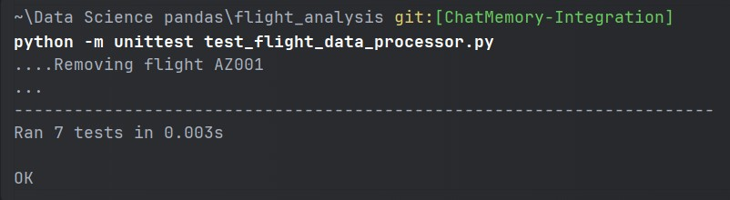

# Flight Data Processor

## Task Description

You are given a list of flight data in JSON format. Each flight entry consists of several details. Your goal is to implement a `FlightDataProcessor` class with advanced features that include handling data transformations and deriving insights from the data.

## Attributes

- `flights`: A list of dictionaries, where each dictionary represents a flight with the following keys:
  - `flight_number` (string)
  - `departure_time` (string in "YYYY-MM-DD HH:MM" format)
  - `arrival_time` (string in "YYYY-MM-DD HH:MM" format)
  - `duration_minutes` (integer)
  - `status` (enum, e.g. "ON_TIME", "DELAYED", "CANCELLED")

## Methods

- `add_flight(data: dict) -> None`: Adds a new flight to the list, ensuring no duplicates (by flight number).
- `remove_flight(flight_number: str) -> None`: Removes a flight based on the flight number.
- `flights_by_status(status: str) -> List[dict]`: Returns all flights with a given status.
- `get_longest_flight() -> dict`: Returns the flight with the longest duration in minutes.
- `update_flight_status(flight_number: str, new_status: str) -> None`: Updates the status of a flight and ensures it reflects in the overall data.

## Requirements

- Implement the class with clean coding practices.
- Use Python's type hinting feature across all methods and method arguments.
- Write comprehensive unit tests using `unittest` to validate all functionalities.

## Example Usage

```python
# Json Data
flight_data = [
    {"flight_number": "AZ001", "departure_time": "2025-02-19 15:30", "arrival_time": "2025-02-20 03:45", "duration_minutes": 735, "status": "ON_TIME"},
    {"flight_number": "AZ002", "departure_time": "2025-02-21 11:00", "arrival_time": "2025-02-21 16:00", "duration_minutes": 300, "status": "DELAYED"},
]

# Initialize the processor
flight_data_processor = FlightDataProcessor(flight_data)

# Add a new flight
flight_data_processor.add_flight({"flight_number": "AZ003", "departure_time": "2025-02-22 09:00", "arrival_time": "2025-02-22 12:00", "duration_minutes": 180, "status": "ON_TIME"})

# Remove a flight
flight_data_processor.remove_flight("AZ002")

# Get flights by status
on_time_flights = flight_data_processor.flights_by_status("ON_TIME")

# Get the longest flight
longest_flight = flight_data_processor.get_longest_flight()

# Update flight status
flight_data_processor.update_flight_status("AZ001", "DELAYED")
```

## Running Unit Tests

To ensure correctness, run the unit tests using the following command:

```sh
python -m unittest test_flight_data_processor.py
```

## Test Results

The unit test execution results are stored in `unittest_result.jpg`. Make sure to review this file before submission.


## From Pranav Chandran